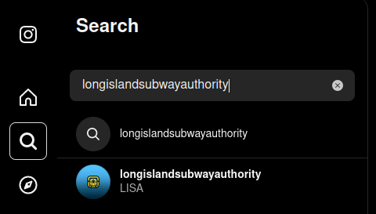
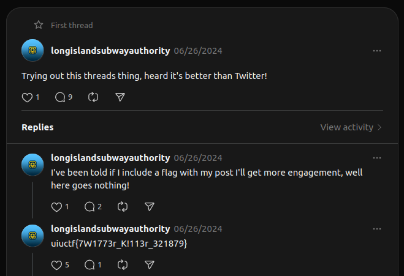

# Solution

This is the solution for "Hip With the Youth", the first challenge in the UIUC-Chan suite. It's an OSINT challenge that introduces participants to how social media can be used to hide information through the use of linked accounts within the same platform. I will reference this challenge in the other two writeups, so I recommend starting here.

We start with the following description:

```
The Long Island Subway Authority (LISA), in an attempt to appeal to the younger generations, has begun experimenting with social media! See if you can find a way to a flag through their Instagram.
```

Based on the description, you can reasonably assume the flag is tied to an Instagram account. If you search `longislandsubwayauthority` on Instagram, you will find the account:



The account contains a few posts, none of which contain the flag. However, if you are familiar with Instagram, you may know that Instagram allows users to link their account to a Threads account, which is an alternate Twitter-like social media platform. If you look around the Instagram account, you can see that there is a Threads account linked:


> [!NOTE]
> During the event, I learned that Threads is not available in every country. If you are unable to access Threads, you may have trouble completing this challenge on your own.

On the Threads account, you will find a post that contains the flag:



The flag is `uiuctf{7W1773r_K!113r_321879}`.