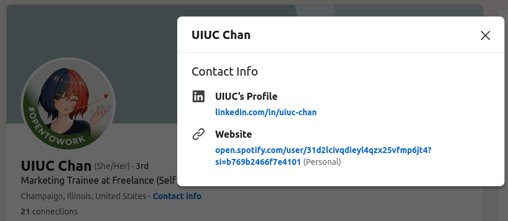
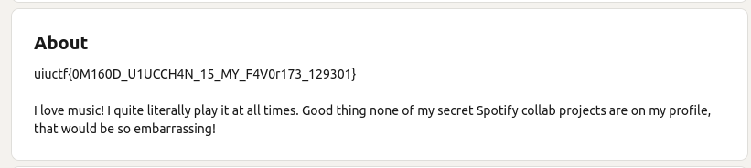
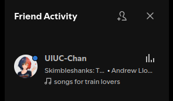
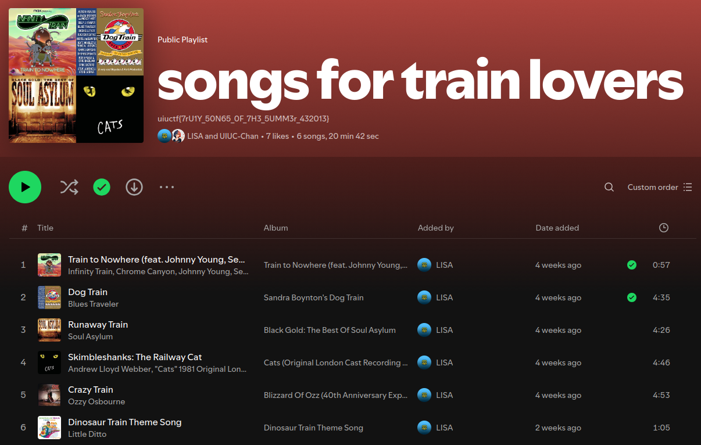

# Solution

This is the solution for "The Weakest Link", the third challenge in the UIUC-Chan suite. It's a more esoteric OSINT challenge that shows how one can discover a collaborative Spotify playlist without it being public on either user's profile. I recommend starting with "An Unlikely Partnership" before reading the writeup for this challenge.

We start with the following description:

```
LISA and the secret business partner have a secret Spotify collaboration planned together. Unfortunately, neither of them have the opsec to keep it private. See if you can figure out what it is!
```

If you go to the LinkedIn profile for "UIUC-Chan" that we found in the previous challenge and look at her contact info, you will find that a Spotify account is linked:



If you go to the Spotify account, you will find a profile with a playlist and (depending on when you solve the challenge) some followers, none of which contain the flag:


If you solved "An Unlikely Partnership" before this challenge, you will have seen UIUC-Chan's LinkedIn bio, which contains a hint for this challenge:



This suggests that the playlist is not public on UIUC-Chan's profile and that UIUC-Chan is constantly playing music. 

## A Weird Spotify Feature

If you are familiar with Spotify, you may know that Spotify has a feature that shows what your friends are currently listening to. While the feature is opt-in, it only requires that you follow the person, not that they follow you back. This means that if you follow UIUC-Chan, you can see what she is currently listening to, assuming it's public. Well, the playlist we want to get the flag from doesn't seem to be public, so how do we see what she is listening to?

Spotify has three levels of privacy granularity for playlists: public, private, and unlisted. Public playlists will show up on your profile, private playlists will only be visible to you, and unlisted playlists will not show up on your profile but can be accessed by anyone with the link. Normally, only public playlists will show up on the "currently listening to" feature, but if the playlist is collaborative, it will show up even if it's unlisted on every account that is collaborating on the playlist. This is presumably because collaborative playlists are meant to be shared with others, so Spotify assumes that if you are collaborating on a playlist, you want others to see what you are listening to. The playlist we are looking for is a collaborative playlist, so we can see what UIUC-Chan is listening to by following her.

> [!NOTE] 
> Officially, you can only access this feature on the desktop version of Spotify. However, there are browser extensions that also enable this feature without needing the desktop version if you don't have access to a computer that can run the desktop version.

## Finding the Flag

If follow UIUC-Chan to see what she is listening to, you will find that she is listening to a playlist called "songs for train lovers":



If you click on the playlist (bangers, really), you will find the flag in the description:



The flag is `uiuctf{7rU1Y_50N65_0F_7H3_5UMM3r_432013}`.